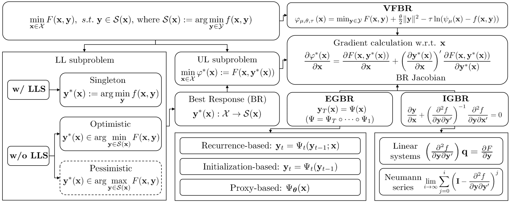

# A Quick Tutorial on Bi-level Optimization

## Introduction
Bi-Level Optimization (BLO) is originated from the area of economic game theory and then introduced into the optimization community. BLO is able to handle problems with a hierarchical structure, involving two levels of optimization tasks, where one task is nested inside the other. 
The standard BLO problem can be formally expressed as 

  

In machine learning and computer vision fields, despite the different motivations and mechanisms, a lot of complex problems, such as hyper-parameter optimization, multi-task and meta learning, neural architecture search, adversarial learning and deep reinforcement learning, actually all contain a series of closely related subproblms. 
In our recent survey published in TPAMI, named "Investigating Bi-Level Optimization for Learning and Vision from a Unified Perspective: A Survey and Beyond", we uniformly express these complex learning and vision problems from the perspective of BLO. Also we construct a best-response-based single-level reformulation and establish a unified algorithmic framework to understand and formulate mainstream gradient-based BLO methodologies, covering aspects ranging from fundamental automatic differentiation schemes to various accelerations, simplifications, extensions and their convergence and complexity properties. We summarize mainstream gradient-based BLOs and illustrate their intrinsic relationships within our general algorithmic platform. 

  

We also discuss the potentials of our unified BLO framework for designing new algorithms and point out some promising directions for future research. 
If you are concerned about bi-level optimization, please refer to our paper for details and cite it [[Paper](https://arxiv.org/abs/2101.11517)].

In this website, we first summarize our related progress and references of existing works for a quick look at the current progress. Futhermore, we provide a list of important papers discussed in this survey, corresponding codes, and additional resources on BLOs. We will continuously maintain this website to promote the research in BLO fields.

## Our Related Work
- [x] ### Papers
- Risheng Liu, Jiaxin Gao, Jin Zhang, Deyu Meng, Zhouchen Lin. Investigating Bi-Level Optimization for Learning and Vision from a Unified Perspective: A Survey and Beyond. IEEE TPAMI 2021. [[Paper](https://arxiv.org/abs/2101.11517)] [[Project Page](https://github.com/vis-opt-group/BLO)] 
- Risheng Liu, Zi Li, Xin Fan, Chenying Zhao, Hao Huang, Zhongxuan Luo. Learning Deformable Image Registration from Optimization: Perspective, Modules, Bilevel Training and Beyond. IEEE TPAMI 2021. [[Paper](https://arxiv.org/abs/2004.14557)]
- Risheng Liu, Long Ma, Jiaao Zhang, Xin Fan, Zhongxuan Luo. Retinex-Inspired Unrolling With Cooperative Prior Architecture Search for Low-Light Image Enhancement. CVPR 2021. [[Paper](https://openaccess.thecvf.com/content/CVPR2021/html/Liu_Retinex-Inspired_Unrolling_With_Cooperative_Prior_Architecture_Search_for_Low-Light_Image_CVPR_2021_paper.html)] [[Project Page](http://dutmedia.org/RUAS/)] 

- Risheng Liu, Yaohua Liu, Shangzhi Zeng, Jin Zhang. Towards Gradient-based Bilevel Optimization with Non-convex Followers and Beyond. NeurIPS 2021 (Spotlight, Acceptance Rate ≤ 3%). [[Paper](https://arxiv.org/abs/2110.00455)] [[Code](https://github.com/vis-opt-group/IAPTT-GM)] 

- Pan Mu, Zhu Liu, Yaohua Liu, Risheng Liu, Xin Fan. Triple-level Model Inferred Collaborative Network Architecture for Video Deraining. IEEE TIP 2021. [[Paper](https://ieeexplore.ieee.org/document/9628137)] [[Code](https://github.com/vis-opt-group/TMICS)] 

- Risheng Liu, Zhu Liu, Jinyuan Liu, Xin Fan. Searching a Hierarchically Aggregated Fusion Architecture for Fast Multi-Modality Image Fusion. ACM MM 2021. [[Paper](https://dl.acm.org/doi/abs/10.1145/3474085.3475299)] [[Code](https://github.com/LiuzhuForFun/Hierarchical-NAS-Image-Fusion)].

- Dian Jin, Long Ma, Risheng Liu, Xin Fan. Bridging the Gap between Low-Light Scenes: Bilevel Learning for Fast Adaptation. ACM MM 2021. [[Paper]](https://dl.acm.org/doi/pdf/10.1145/3474085.3475404) 

<!--  -->

  

- Risheng Liu, Xuan Liu, Xiaoming Yuan, Shangzhi Zeng, Jin Zhang. A Value Function-based Interior-point Method for Non-convex Bilevel Optimization. ICML 2021.[[Paper]](https://arxiv.org/pdf/2106.07991.pdf)[[Code]](https://github.com/vis-opt-group/BVFSM)

<!--  -->

  

- Yaohua Liu, Risheng Liu. BOML: A Modularized Bilevel Optimization Library in Python for Meta-learning. ICME 2021.[[Paper]](https://arxiv.org/abs/2009.13357)[[Code]](https://github.com/dut-media-lab/BOML)

<!--  -->
 

  

- Risheng Liu, Pan Mu, Xiaoming Yuan, Shangzhi Zeng, Jin Zhang. A Generic First-Order Algorithmic Framework for Bi-Level Programming Beyond Lower-Level Singleton. ICML 2020. [[Paper]](https://arxiv.org/abs/2006.04045)[[Code]](https://github.com/vis-opt-group/BDA)

<!--  -->

  

- Risheng Liu, Pan Mu, Jian Chen, Xin Fan, Zhongxuan Luo. Investigating Task-driven Latent Feasibility for Nonconvex Image Modeling.  IEEE TIP 2020.[[Code]](https://arxiv.org/abs/1910.08242)

<!--  -->

  

- Risheng Liu, Zi Li, Yuxi Zhang, Xin Fan, Zhongxuan Luo. Bi-level Probabilistic Feature Learning for Deformable Image Registration. IJCAI 2020.[[Paper]](https://www.ijcai.org/Proceedings/2020/0101.pdf) [[code]](https://github.com/Alison-brie/MultiPropReg)

<!--  -->

- [x] ### Bi-level Optimization Methods Toolkits
We have published [BOML](https://github.com/dut-media-lab/BOML) previously, a modularized Tensorflow-based optimization library that unifies several ML algorithms into a common bilevel optimization framework. Now we integrate more recently proposed algorithms and more compatible applications and release the Pytorch version.

#### Integrated Algoithms
 - [Model-Agnostic Meta-Learning for Fast Adaptation of Deep Networks (MAML)](https://arxiv.org/abs/1703.03400)
 - [On First-Order Meta-Learning Algorithms (FMAML)](https://arxiv.org/abs/1703.03400)
 - [Meta-SGD: Learning to Learn Quickly for Few-Shot Learning (Meta-SGD)](https://arxiv.org/pdf/1707.09835.pdf)
 - [Learning to Forget for Meta-Learning (L2F)](https://openaccess.thecvf.com/content_CVPR_2020/papers/Baik_Learning_to_Forget_for_Meta-Learning_CVPR_2020_paper.pdf)
 - [Bilevel Programming for Hyperparameter Optimization and Meta-Learning (RAD)](http://export.arxiv.org/pdf/1806.04910)
 - [Truncated Back-propagation for Bilevel Optimization (T-RAD)](https://arxiv.org/pdf/1810.10667.pdf)
 - [Gradient-Based Meta-Learning with Learned Layerwise Metric and Subspace (MT-Net)](http://proceedings.mlr.press/v80/lee18a/lee18a.pdf)
 - [Meta-Learning with warped gradient Descent (WarpGrad))](https://arxiv.org/abs/1909.00025)
 - [DARTS: Differentiable Architecture Search (OS-RAD)](https://arxiv.org/pdf/1806.09055.pdf)
 - [A Generic First-Order Algorithmic Framework for Bi-Level Programming Beyond Lower-Level Singleton (BDA)](https://arxiv.org/pdf/2006.04045.pdf)
 - [Meta-Learning with Implicit Gradients (LS)](https://arxiv.org/pdf/1909.04630.pdf)
 - [Optimizing millions of hyperparameters by implicit differentiation (NS)](https://arxiv.org/pdf/1911.02590.pdf)
 - [Towards Gradient-based Bilevel Optimization with Non-convex Followers and Beyond (IAPTT-GM)](https://arxiv.org/abs/2110.00455) 

## Parts of Existing Work in Learning and Vision Fields
- [x] ### Gradient-based Optimization
- Luca Franceschi, Michele Donini, Paolo Frasconi, Massimiliano Pontil. [Forward and Reverse Gradient-Based Hyperparameter Optimization. ICML 2017.](https://arxiv.org/abs/1703.01785)
- Amirreza Shaban, Ching-An Cheng, Nathan Hatch, Byron Boots. [Truncated Back-propagation for Bilevel Optimization. AISTATS 2019.](http://proceedings.mlr.press/v89/shaban19a.html)
- Hanxiao Liu, Karen Simonyan, Yiming Yang. [DARTS: Differentiable Architecture Search. ICLR 2019.](https://arxiv.org/abs/1806.09055)
- Chelsea Finn, Pieter Abbeel, Sergey Levine. [Model-Agnostic Meta-Learning for Fast Adaptation of Deep Networks. ICML 2017.](https://arxiv.org/abs/1703.03400)
- Alex Nichol, Joshua Achiam, John Schulman. [On First-Order Meta-Learning Algorithms. arXiv 2018.](https://arxiv.org/abs/1803.02999)
- Sebastian Flennerhag, Andrei A. Rusu, Razvan Pascanu, Francesco Visin, Hujun Yin, Raia Hadsell. [Meta-Learning with Warped Gradient Descent. ICLR 2020.](https://arxiv.org/abs/1909.00025)
- Eunbyung Park, Junier B. Oliva. [Meta-Curvature. NeurIPS 2019.](https://proceedings.neurips.cc/paper/2019/hash/57c0531e13f40b91b3b0f1a30b529a1d-Abstract.html)
- Yoonho Lee, Seungjin Choi. [Meta-Learning with Adaptive Layerwise Metric and Subspace. arXiv 2018.](https://arxiv.org/abs/1801.05558v1)
- Matthew MacKay, Paul Vicol, Jon Lorraine, David Duvenaud, Roger Grosse.[ Self-tuning Networks: Bilevel Optimization of Hyperparameters Using Structured Best-response Functions. ICLR 2019.](https://arxiv.org/pdf/1903.03088.pdf)
- Jonathan Lorraine, David Duvenaud. [Stochastic Hyperparameter Optimization through Hypernetworks. arXiv 2018.](https://arxiv.org/pdf/1802.09419.pdf)
- Fabian Pedregosa. [Hyperparameter Optimization with Approximate Gradient. ICML 2016.](https://arxiv.org/pdf/1602.02355.pdf)
- Aravind Rajeswaran, Chelsea Finn, Sham Kakade, Sergey Levine. [Meta-Learning with Implicit Gradients. NeurIPS 2019.](https://arxiv.org/pdf/1909.04630.pdf)
- Jonathan Lorraine, Paul Vicol, David Duvenaud. [Optimizing Millions of Hyperparameters by Implicit Differentiation. AISTATS 2020.](https://arxiv.org/pdf/1911.02590.pdf)
### Hyper-parameter Optimization
- Luca Franceschi, Michele Donini, Paolo Frasconi, Massimiliano Pontil. [Forward and Reverse Gradient-Based Hyperparameter Optimization. ICML 2017.](https://arxiv.org/abs/1703.01785)
- Amirreza Shaban, Ching-An Cheng, Nathan Hatch, Byron Boots. [Truncated Back-propagation for Bilevel Optimization. AISTATS 2019.](http://proceedings.mlr.press/v89/shaban19a.html)
- Matthew MacKay, Paul Vicol, Jon Lorraine, David Duvenaud, Roger Grosse. [Self-tuning networks: Bilevel Optimization of Hyperparameters Using Structured Best-response Functions. ICLR 2019.](https://arxiv.org/pdf/1903.03088.pdf)
- Fabian Pedregosa. [Hyperparameter Optimization with Approximate Gradient. ICML 2016.](http://proceedings.mlr.press/v48/pedregosa16.pdf)
- D. Maclaurin, D. Duvenaud, and R. Adams. [Gradient-Based Hyperparameter Optimization Through Reversible Learning. PMLR 2015.](https://arxiv.org/abs/1502.03492)
- Takayuki Okuno, Akiko Takeda, Akihiro Kawana. [Hyperparameter Learning via Bilevel Nonsmooth Optimization. arXiv 2018](https://arxiv.org/abs/1806.01520)
- Ankur Sinha, Tanmay Khandait, Raja Mohanty. [A Gradient-based Bilevel Optimization Approach for Tuning Hyperparameters in Machine Learning. arXiv 2020.](https://arxiv.org/pdf/2007.11022.pdf)
### Multi-task and Meta-learning
- Alex Nichol, Joshua Achiam, John Schulman. [On First-Order Meta-Learning Algorithms. arXiv 2018.](https://arxiv.org/abs/1803.02999)
- Sebastian Flennerhag, Andrei A. Rusu, Razvan Pascanu, Francesco Visin, Hujun Yin, Raia Hadsell. [Meta-Learning with Warped Gradient Descent. ICLR 2020.](https://arxiv.org/abs/1909.00025)
- Aravind Rajeswaran, Chelsea Finn, Sham Kakade, Sergey Levine. [Meta-Learning with Implicit Gradients. NIPS 2019.](https://arxiv.org/pdf/1909.04630.pdf)
- Luca Franceschi, Paolo Frasconi, Michele Donini, Massimiliano Pontil. [A Bridge Between Hyperparameter Optimization and Learning-to-learn, NeurIPS 2017.](https://arxiv.org/pdf/1712.06283.pdf)
- Luca Franceschi, Paolo Frasconi, Saverio Salzo, Riccardo Grazzi, Massimilano Pontil. [Bilevel Programming for Hyperparameter Optimization and Meta-learning. ICML 2018.](https://arxiv.org/abs/1806.04910)
- Luca Bertinetto, João F. Henriques, Philip H.S. Torr, Andrea Vedaldi. [Meta-learning with Differentiable Closed-form Solvers, ICLR 2019.](https://arxiv.org/abs/1805.08136)
- Alex Nichol, John Schulman. Reptile: A Scalable Metalearning Algorithm.
- Alesiani Francesco, Shujian Yu, Ammar Shaker, and Wenzhe Yin. [Towards Interpretable Multi-Task Learning Using Bilevel Programming. ECML PKDD 2020](https://arxiv.org/pdf/2009.05483.pdf)

### Neural Architecture Search
- Hanxiao Liu, Karen Simonyan, Yiming Yang. [DARTS: Differentiable Architecture Search. ICLR 2019.](https://arxiv.org/abs/1806.09055)
- Yibo Hu, Xiang Wu, Ran He. [TF-NAS: Rethinking Three Search Freedoms of Latency-constrained Differentiable Neural Architecture Search. ECCV 2020.](https://arxiv.org/abs/2008.05314)
- Dongze Lian, Yin Zheng, Yintao Xu, Yanxiong Lu, Leyu Lin, Peilin Zhao, Junzhou Huang, Shenghua Gao. [Towards Fast Adaptation of Neural Architectures with Meta-learning. ICLR 2019.](https://openreview.net/forum?id=r1eowANFvr)
- Yuhui Xu, Lingxi Xie, Xiaopeng Zhang, Xin Chen, Guo-Jun Qi, Qi Tian, Hongkai Xiong. [PC-Darts: Partial channel connections for memory-efficient architecture search. ICLR 2019.](https://arxiv.org/abs/1907.05737)
### Generative Adversarial Learning
- Yi Li, Lingxiao Songa, Xiang Wu, Ran He, Tieniu Tan.[Learning a Bi-level Adversarial Network with Global and Local Perception for Makeup-invariant Face Verification. Pattern Recognition 2019.](https://www.sciencedirect.com/science/article/pii/S003132031930024X) 
- Haoming Jiang, Zhehui Chen, Yuyang Shi, Bo Dai, Tuo Zhao. [Learning to defense by learning to attack. ICLR 2019.](https://arxiv.org/abs/1811.01213)
- Yuesong Tian, Li Shen, Li Shen, Guinan Su, Zhifeng Li, Wei Liu. [Alphagan: Fully Differentiable Architecture Search for Generative Adversarial Networks. CVPR 2020.](https://arxiv.org/abs/2006.09134)
### Deep Reinforcement Learning
- Haifeng Zhang, Weizhe Chen, Zeren Huang, Minne Li, Yaodong Yang, Weinan Zhang, Jun Wang. [Bi-level Actor-critic for Multi-agent Coordination. AAAI 2020](https://arxiv.org/abs/1909.03510)
- David Pfau, Oriol Vinyals. [Connecting Generative Adversarial Networks and Actor-critic Methods. NeurIPS 2016.](https://arxiv.org/abs/1610.01945)
- Zhuoran Yang, Yongxin Chen, Mingyi Hong, Zhaoran Wang. [Provably Global Convergence of Actor-critic: A Case for Linear Quadratic Regulator with Ergodic Cost. NeurIPS 2019.](https://proceedings.neurips.cc/paper/2019/hash/9713faa264b94e2bf346a1bb52587fd8-Abstract.html)
- Zhangyu Chen, Dong Liu, Xiaofei Wu, Xiaochuan Xu. [Research on Distributed Renewable Energy Transaction Decision-making based on Multi-Agent Bilevel Cooperative Reinforcement Learning. CIRED 2019.](https://www.cired-repository.org/handle/20.500.12455/390)
- Ying Liu, Wenhong Cai, Xiaohui Yuan, Jinhai Xiang. [GL-GAN: Adaptive Global and Local Bilevel Optimization model of Image Generation. arXiv 2020.] (https://arxiv.org/abs/2008.02436)
- Chen, Zhangyu and Liu, Dong and Wu, Xiaofei and Xu, Xiaochun. [Research on Distributed Renewable Energy Transaction Decision-making Based on Multi-Agent Bilevel Cooperative Reinforcement Learning. CIRED 2019.](https://www.researchgate.net/publication/324250638_Reinforcement_Learning_Approach_for_Optimal_Distributed_Energy_Management_in_a_Microgrid)
- Yang, Jiachen and Borovikov, Igor and Zha, Hongyuan. [Hierarchical cooperative multi-agent reinforcement learning with skill discovery. AAMAS 2020.](https://arxiv.org/abs/1912.03558)
- Wang, Xuechun and Chen, Hongkun and Wu, Jun and Ding, Yurong and Lou, Qinghui and Liu, Shuwei. [Bi-level Multi-agents Interactive Decision-making Model in Regional Integrated Energy System. Energy Internet and Energy System Integration 2019.](https://ieeexplore.ieee.org/abstract/document/9061889)
- Torabi, Faraz and Warnell, Garrett and Stone, Peter. [Generative adversarial imitation from observation. arXiv 2018.](https://arxiv.org/abs/1807.06158)
- Li, Yunzhu and Song, Jiaming and Ermon, Stefano. [Infogail: Interpretable imitation learning from visual demonstrations. NeurIPS 2017.](https://arxiv.org/abs/1703.08840)
### Other Applications
- Sanjeev Arora, Simon S. Du, Sham Kakade, Yuping Luo, Nikunj Saunshi. [Provable Representation Learning for Imitation Learning via Bi-level Optimization. arXiv 2020.](https://arxiv.org/abs/2002.10544)
- Basura Fernando, Stephen Gould. [Learning End-to-end Video Classification with Rank-pooling. ICML 2016.](http://proceedings.mlr.press/v48/fernando16.pdf)

## Citation
    If this paper is helpful for your research, please cite our paper:
    @article{liu2021investigating,
    title={Investigating bi-level optimization for learning and vision from a unified perspective: A survey and beyond},   
    author={Liu, Risheng and Gao, Jiaxin and Zhang, Jin and Meng, Deyu and Lin, Zhouchen},   
    journal={arXiv preprint arXiv:2101.11517},   
    year={2021}
    }
